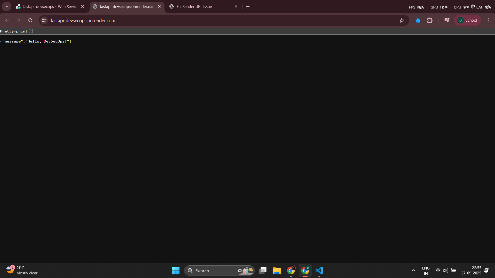
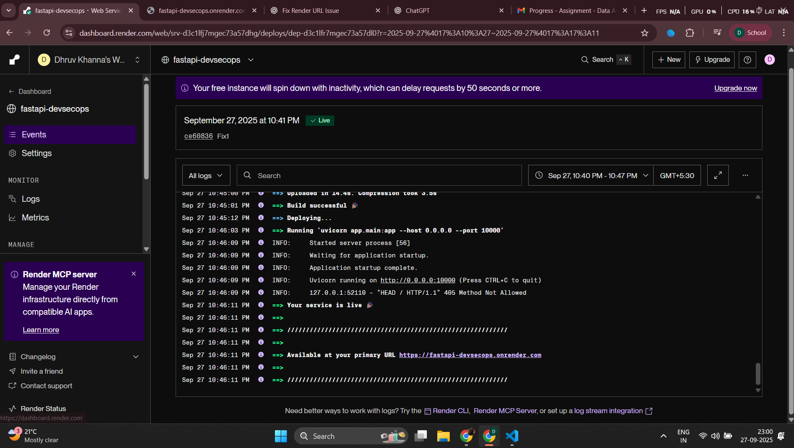

# Simple FastAPI DevSecOps App

## 🛡️ Build & Security Status

These badges reflect the real-time status of our CI pipeline and security checks.

---

## 🌍 Deployed Application

The application is automatically deployed to a live environment after passing all checks in the CI pipeline.

Check out the live deployment on **Render**: [https://fastapi-devsecops.onrender.com](https://fastapi-devsecops.onrender.com)

---

## 🛠️ Project Structure and Technology Stack

### Application (Python/FastAPI)

* **Framework:** [FastAPI](https://fastapi.tiangolo.com/) - A modern, fast (high-performance) web framework for building APIs with Python 3.7+.
* **Server:** [Uvicorn](https://www.uvicorn.com/) - An ASGI server implementation for Python.
* **Entry Point:** `app/main.py` exposes a single endpoint, `/`, which returns `{"message": "Hello, DevSecOps!"}`.

### Testing and Quality

* **Unit Tests:** [Pytest](https://docs.pytest.org/) is used for running the automated unit tests defined in `tests/test_main.py`.
* **Linting:** [Flake8](https://flake8.pycqa.org/en/latest/) is used to check the code style and syntax against standard Python conventions, enforcing high-quality, readable code.

---

## 🚀 DevSecOps Pipeline: Automated Checks

The core of this project is the **GitHub Actions** CI pipeline (`.github/workflows/ci.yml`), which runs automatically on every **push** and **pull request** to the `main` branch.

This single pipeline combines *development*, *testing*, and *security* steps to create an effective security gate.

### Pipeline Steps (Run in Order):

1.  **Code Checkout & Setup:** Checks out the repository and sets up a Python 3.10 environment.
2.  **Dependency Installation:** Installs all project dependencies from `requirements.txt`.
3.  **Run Lint (Quality Gate):** Executes **Flake8** to ensure code quality and adherence to style guides. *A linting failure stops the pipeline.*
4.  **Run Tests (Reliability Gate):** Executes **Pytest** to verify that the application logic works as expected. *A test failure stops the pipeline.*
5.  **Static Application Security Testing (SAST):** Executes **Bandit** to scan the application code (`app/`) for common security issues like hardcoded passwords, use of vulnerable functions, and other best-practice violations.
6.  **Secret Scanning:** Uses **Trufflehog** to recursively scan the entire repository for any accidentally committed secrets (API keys, tokens, etc.). This ensures no sensitive data is leaked into the codebase. *If a secret is found, the commit/PR is rejected (fails the pipeline).*
7.  **Deployment :** Although not part of the `ci.yml`, the successful completion of these checks typically triggers an automatic deployment to **Render**.

This setup ensures that only code that is **functional**, **clean**, and **secure** ever makes it to the main branch or a deployment environment.

